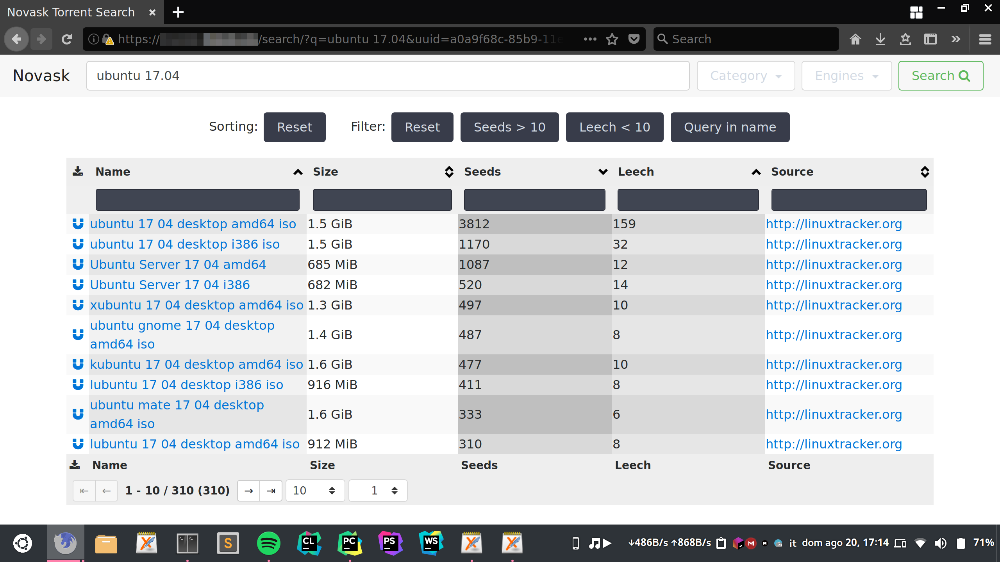

# Novask Torrent Search

A Python3, Flask-based torrent search engine based on qBittorrent's.



## Testing

#### Make sure SQLite3 is installed

```sh
sudo apt install sqlite3
```

#### Clone the repository

```sh
git clone https://github.com/Depaulicious/Novask
```

#### Install Novask in development mode
You may need to run `pip3` as root, or use just `pip`. Note that Python2 *should* work but is not supported.

```sh
cd Novask
pip3 install -e .
```

#### Create the search engines directory

```sh
mkdir -p instance/engines
```

#### Download search plugins
Put them in `instance/engines`.

Note that [Nova6](https://github.com/Depaulicious/Nova6) (the back-end) should support both Python2 and Python3 plugins out-of-the-box; however, if there are both Python2 and 3 versions, use the one that matches the version of the interpreter you're planning to run this in.

Some common sources:

- https://github.com/qbittorrent/search-plugins/tree/master/nova3/engines
- https://github.com/qbittorrent/search-plugins/wiki/Unofficial-search-plugins

#### Create testing database

By default, Novask uses an SQLite database at `/tmp/test.db`.

Create it:

```sh
python3 -c "from novask.database import db; db.create_all()"
``` 

#### Run the development server

```sh
export FLASK_APP=novask
export FLASK_DEBUG=true
flask run
```

You should be able to test Novask at [localhost:5000](http://localhost:5000).

## Deploying

- [On Apache](https://github.com/Depaulicious/Novask/wiki/Deploy-with-Apache)